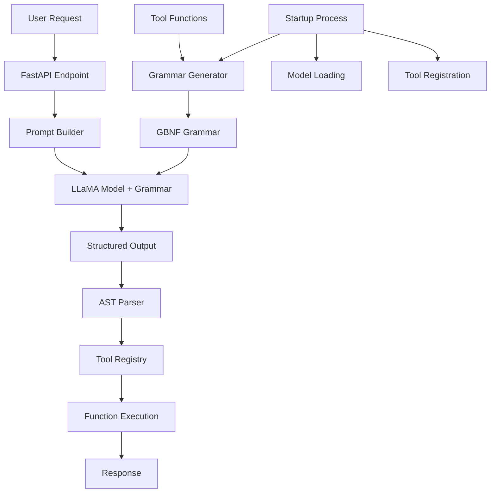

# Design Document

## Overview

The Grammar-Constrained Decoding (GCD) system is designed as a Python + FastAPI application that enables local LLaMA models to execute Python functions through structured, grammar-constrained output. The system bridges LLM reasoning capabilities with real-world function execution by enforcing strict output formats using GBNF (GGML Backus-Naur Form) grammars.

The core innovation is the automatic generation of combined grammars from Python function introspection, ensuring the LLM can only output valid function calls that match defined tool signatures. This eliminates the need for complex output parsing and significantly reduces error rates compared to free-form text generation.

## Architecture

### High-Level Architecture



### Component Architecture

The system follows a modular architecture with clear separation of concerns:

1. **Tool Definition Layer** - Python functions with type hints and docstrings
2. **Grammar Generation Layer** - Automatic GBNF grammar construction from tool introspection
3. **Model Integration Layer** - llama.cpp model loading and grammar-constrained inference
4. **API Layer** - FastAPI endpoints for HTTP request handling
5. **Execution Layer** - Safe parsing, validation, and function execution
6. **Error Handling Layer** - Comprehensive error management and fallback strategies

## Components and Interfaces

### 1. Tool Definition System

**Purpose**: Define callable functions that the LLM can invoke with proper metadata.

**Interface**:
```python
def tool_function(param1: type1, param2: type2 = default) -> return_type:
    """
    Tool description for LLM prompting.
    
    Args:
        param1 (type1): Parameter description
        param2 (type2, optional): Optional parameter description
    
    Returns:
        return_type: Return value description
        
    Grammar:
        <CustomCall> ::= "tool_function(" <string> (", " <custom_type>)? ")"
        <custom_type> ::= "\"value1\"" | "\"value2\""
    """
    # Implementation
    return result
```

**Key Features**:
- Type hints for automatic grammar generation
- Docstring parsing for LLM prompt generation
- Optional custom grammar specifications
- Support for default parameters

### 2. Grammar Generation Engine

**Purpose**: Automatically generate combined GBNF grammar from tool definitions.

**Core Algorithm**:
```python
def build_grammar(tools: List[Callable]) -> str:
    # 1. Introspect each tool function
    # 2. Extract custom grammar from docstrings (if present)
    # 3. Generate default grammar from type hints (if no custom grammar)
    # 4. Collect required base type rules
    # 5. Combine into single grammar with root rule
    # 6. Return GBNF grammar string
```

**Grammar Structure**:
- **Root Rule**: `root ::= <Tool1Call> | <Tool2Call> | ...`
- **Tool Rules**: `<ToolCall> ::= "tool_name(" <arg1> ", " <arg2> ")"`
- **Type Rules**: Base definitions for `<string>`, `<int>`, `<float>`, `<bool>`
- **Custom Rules**: Developer-specified grammar overrides

**Type Mapping**:
- `str` → `<string>` (JSON-style quoted strings with escape sequences)
- `int` → `<int>` (optional minus sign + digits)
- `float` → `<float>` (decimal numbers with optional fractional part)
- `bool` → `<bool>` ("True" | "False")
- Complex types → `<string>` (with optional Pydantic validation)

### 3. Model Integration System

**Purpose**: Load and manage llama.cpp models with grammar constraints.

**Components**:
- **Model Loader**: Initialize Llama model with appropriate parameters
- **Grammar Manager**: Create and manage LlamaGrammar objects
- **Inference Engine**: Execute grammar-constrained generation
- **Concurrency Controller**: Ensure thread-safe model access

**Configuration**:
```python
llm = Llama(
    model_path="path/to/model.gguf",
    n_ctx=2048,           # Context window size
    n_threads=8,          # CPU threads for inference
    verbose=False         # Suppress debug output
)

grammar = LlamaGrammar.from_string(grammar_text, verbose=False)
```

**Thread Safety Strategy**:
- Single model instance with serialized access using `asyncio.Lock`
- Alternative: Multiple model instances for true concurrency (higher memory usage)
- Request queuing to prevent race conditions

### 4. Prompt Engineering System

**Purpose**: Generate effective prompts that guide the LLM to use tools correctly.

**Prompt Structure**:
```python
system_message = f"""
You are a smart assistant with access to the following tools:
{auto_generated_tool_descriptions}

When asked a question, if it requires one of these tools, respond **only** with a single tool call in the exact format: tool_name(arg1, arg2, ...). No explanations.
"""
```

**Tool Description Generation**:
- Extract function name and signature
- Parse docstring for description
- Format as: `- function_name(param1: type1, param2: type2 = default): description`
- Automatically update when tools change

**Inference Parameters**:
- `temperature=0.0` for deterministic output
- `grammar=grammar_object` for format enforcement
- `max_tokens=50` to prevent infinite generation
- Optional few-shot examples for complex scenarios

### 5. Output Parsing and Validation System

**Purpose**: Safely parse and validate LLM outputs before execution.

**Parsing Pipeline**:
```python
def parse_tool_call(output: str) -> Tuple[str, List[Any]]:
    # 1. Parse using Python AST (safe, no eval)
    # 2. Validate structure (single function call)
    # 3. Extract function name and arguments
    # 4. Return parsed components
```

**Validation Layers**:
1. **Syntax Validation**: AST parsing ensures valid Python syntax
2. **Structure Validation**: Verify single function call format
3. **Registry Validation**: Confirm function exists in tool registry
4. **Signature Validation**: Check argument count and types
5. **Pydantic Validation**: Optional deep validation for complex types

**Security Measures**:
- Never use `eval()` on raw LLM output
- Only allow `ast.Constant` arguments (no expressions)
- Validate function names against known registry
- Treat all arguments as potentially untrusted input

### 6. Tool Registry and Execution System

**Purpose**: Manage tool functions and execute validated calls safely.

**Registry Structure**:
```python
tool_registry = {
    "function_name": function_object,
    # ... other tools
}
```

**Execution Pipeline**:
1. Look up function in registry
2. Validate argument count and types
3. Apply type conversions if needed
4. Execute function with validated arguments
5. Handle exceptions and return results
6. Serialize complex return types

**Error Handling**:
- Function not found → structured error response
- Argument validation failure → type conversion attempt
- Execution exception → caught and returned as error
- Timeout handling for long-running tools

### 7. FastAPI Application Layer

**Purpose**: Provide HTTP API interface for the GCD system.

**Endpoint Design**:
```python
@app.post("/ask", response_model=AnswerResponse)
async def ask_question(req: QueryRequest):
    # 1. Build prompt with tool descriptions
    # 2. Call model with grammar constraints
    # 3. Parse and validate output
    # 4. Execute tool function
    # 5. Return result or error
```

**Request/Response Models**:
```python
class QueryRequest(BaseModel):
    question: str
    temperature: Optional[float] = 0.0
    max_tokens: Optional[int] = 50

class AnswerResponse(BaseModel):
    answer: str
    tool_used: Optional[str] = None
    execution_time: Optional[float] = None
    error: Optional[str] = None
```

**Startup Sequence**:
1. Load and register tool functions
2. Generate combined grammar
3. Initialize LlamaGrammar object
4. Load LLaMA model
5. Create tool registry
6. Start FastAPI server

## Data Models

### Tool Function Metadata
```python
@dataclass
class ToolMetadata:
    name: str
    function: Callable
    signature: inspect.Signature
    docstring: str
    custom_grammar: Optional[str]
    description: str
    parameters: List[ParameterInfo]
```

### Grammar Components
```python
@dataclass
class GrammarRule:
    name: str
    definition: str
    dependencies: List[str]

@dataclass
class GeneratedGrammar:
    root_rule: str
    tool_rules: List[GrammarRule]
    type_rules: List[GrammarRule]
    full_grammar: str
```

### Execution Context
```python
@dataclass
class ExecutionContext:
    request_id: str
    user_question: str
    generated_prompt: str
    model_output: str
    parsed_call: Optional[Tuple[str, List[Any]]]
    execution_result: Any
    execution_time: float
    errors: List[str]
```

## Error Handling

### Error Categories and Responses

1. **Grammar Generation Errors**
   - Invalid function signatures
   - Malformed custom grammar
   - Type mapping failures
   - Response: Startup failure with detailed error message

2. **Model Loading Errors**
   - Model file not found
   - Insufficient memory
   - Incompatible model format
   - Response: Startup failure with resource guidance

3. **Inference Errors**
   - Model generation timeout
   - Grammar constraint violations
   - Memory exhaustion during generation
   - Response: HTTP 500 with fallback attempt

4. **Parsing Errors**
   - Invalid syntax in model output
   - Unexpected output structure
   - AST parsing failures
   - Response: HTTP 400 with parsing error details

5. **Validation Errors**
   - Unknown function names
   - Argument count mismatches
   - Type validation failures
   - Response: HTTP 400 with validation error details

6. **Execution Errors**
   - Tool function exceptions
   - Network timeouts in tools
   - Resource access failures
   - Response: HTTP 500 with tool error details

### Fallback Strategies

1. **Grammar Parsing Failure**: Attempt free-form generation without grammar
2. **Tool Execution Failure**: Return structured error with suggested alternatives
3. **Model Timeout**: Terminate generation and return timeout error
4. **Concurrency Issues**: Queue requests and retry with backoff

## Testing Strategy

### Unit Testing
- **Grammar Generation**: Test grammar correctness for various function signatures
- **Parsing Logic**: Validate AST parsing with edge cases
- **Tool Registry**: Test function lookup and validation
- **Type Conversion**: Verify argument type handling

### Integration Testing
- **End-to-End Flow**: Complete request → response cycles
- **Model Integration**: Test with actual LLaMA models
- **Concurrency**: Multi-threaded request handling
- **Error Scenarios**: Comprehensive failure mode testing

### Performance Testing
- **Throughput**: Requests per second under load
- **Memory Usage**: Model memory consumption patterns
- **Latency**: Response time distribution
- **Grammar Complexity**: Impact of grammar size on performance

### Validation Testing
- **Grammar Compliance**: Verify all outputs match grammar
- **Function Execution**: Confirm correct tool invocation
- **Security**: Test input sanitization and injection prevention
- **Model Compatibility**: Test with different LLaMA model variants

## Performance Considerations

### Optimization Strategies

1. **Startup Optimization**
   - Load model once at application start
   - Pre-generate and cache grammar objects
   - Warm up model with sample inference

2. **Runtime Optimization**
   - Reuse grammar objects across requests
   - Implement request queuing for thread safety
   - Use deterministic decoding (temperature=0.0)
   - Limit max_tokens to prevent runaway generation

3. **Memory Management**
   - Monitor model memory usage
   - Implement graceful degradation under memory pressure
   - Consider model quantization for resource-constrained environments

4. **Concurrency Handling**
   - Single model with serialized access (simple, memory-efficient)
   - Multiple model instances (higher throughput, more memory)
   - Hybrid approach with model pooling

### Performance Monitoring

- Request latency distribution
- Model inference time
- Grammar constraint overhead
- Memory usage patterns
- Error rate tracking
- Tool execution performance

This design provides a robust, scalable foundation for implementing grammar-constrained decoding with llama.cpp while maintaining security, performance, and extensibility requirements.